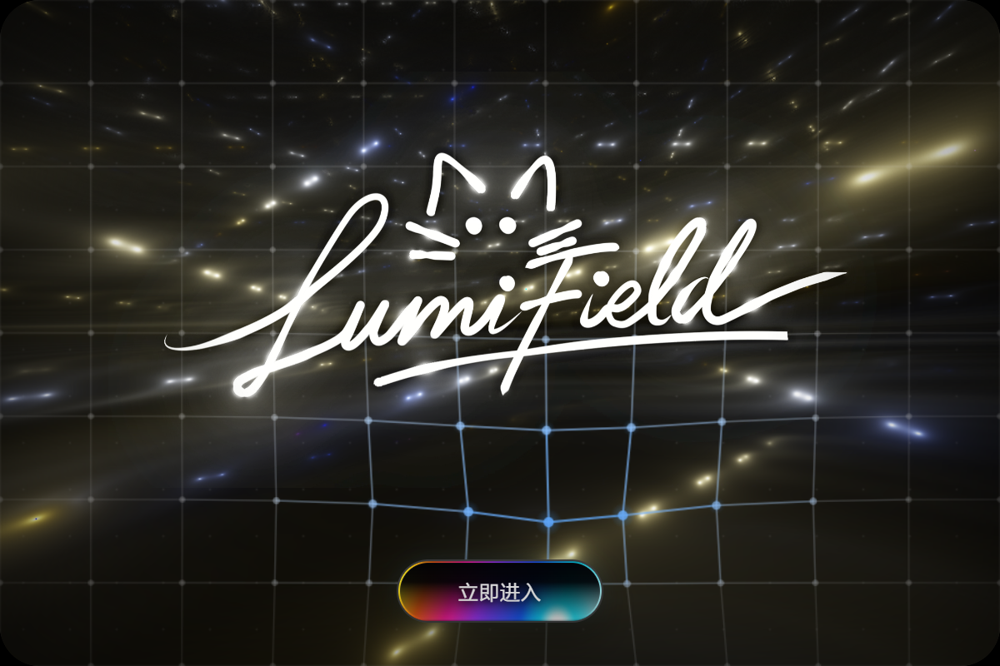

# LumiField



LumiField 是面向 Windows 的沉浸式开源音乐播放器，把本地播放、天气电台、动态歌词、音频频谱、粒子舞台和 3D 歌单组合成一个连续的空间化体验。

当前稳定版本：**v1.1.44** · Windows 10/11 x64 · GPL-3.0-only

[下载 Windows 安装包](https://github.com/xiaodengdengxnjvkjxbnxj/LumiField/releases/download/v1.1.44/LumiField-1.1.44-Setup.exe) · [查看 Release](https://github.com/xiaodengdengxnjvkjxbnxj/LumiField/releases/tag/v1.1.44) · [官方网页](https://xiaodengdengxnjvkjxbnxj.github.io/LumiField/)

## 主要能力

- 主界面天气、电台、搜索、继续听和歌单入口
- 副界面音频频谱、3D 歌单、舞台歌词与多套粒子预设
- 两种音域回响、节奏镜头、可调视觉控制台和用户存档
- 五平台账号状态隔离、本地队列与失败自动跳过
- 动态天气图标、语音助手、桌面歌词和本地伴唱分离
- 可交互开屏、可降低动态效果的无障碍模式与分层性能策略

## 安装

只使用正式 Release 中的 `LumiField-1.1.44-Setup.exe`。安装包会创建 LumiField 桌面和开始菜单快捷方式。v1.1.43 已冻结保留；`v1.0.10` 及更早历史安装包不再建议安装或传播。

发布资产的文件大小、SHA-256、源码提交和内部版本见 [RELEASE_MANIFEST.json](https://github.com/xiaodengdengxnjvkjxbnxj/LumiField/releases/download/v1.1.44/RELEASE_MANIFEST.json) 与 [SHA256SUMS](https://github.com/xiaodengdengxnjvkjxbnxj/LumiField/releases/download/v1.1.44/SHA256SUMS)。

## 从源码运行与构建

```powershell
git clone --branch v1.1.44 https://github.com/xiaodengdengxnjvkjxbnxj/LumiField.git
cd LumiField
npm ci
npm start
```

Windows 安装包：

```powershell
npm run test:lf
npm run build:win
```

完整环境、构建、签名与核验步骤见 [BUILD.md](./BUILD.md)。源码与二进制对应关系见 [SOURCE_CODE_AVAILABILITY.md](./SOURCE_CODE_AVAILABILITY.md)。

## 许可证与来源

LumiField 以 GNU GPL v3（`GPL-3.0-only`）发布，完整文本见 [LICENSE](./LICENSE)。第三方归属、组件级来源、固定版本/Commit 和分发义务见：

- [THIRD_PARTY_NOTICES.md](./THIRD_PARTY_NOTICES.md)
- [NOTICE.md](./NOTICE.md)
- [MODIFICATIONS.md](./MODIFICATIONS.md)
- [docs/licenses](./docs/licenses)

已从 v1.1.44 产品中移除的金色星轨粒子预设与仍在使用的 LumiField 签名动画均保留项目所有者原创来源记录；历史证据见 [原创素材记录](./docs/licenses/lumifield-original-assets/PROVENANCE.md)，不表示已移除预设仍被打包或加载。

## 隐私与第三方平台

Cookie、账号状态、播放历史、自定义歌词/封面和本地缓存只保存在用户设备，不属于仓库内容。LumiField 不是网易云音乐、QQ 音乐、酷狗音乐或汽水音乐的官方客户端，也不提供绕过付费、会员或内容版权限制的能力。详见 [PRIVACY.md](./PRIVACY.md)。

## 致谢

LumiField 基于 XxHuberrr 的 GPL-3.0 Mineradio 项目持续开发，并保留其版权、许可和必要署名。感谢所有上游作者、组件作者、测试者和贡献者。
